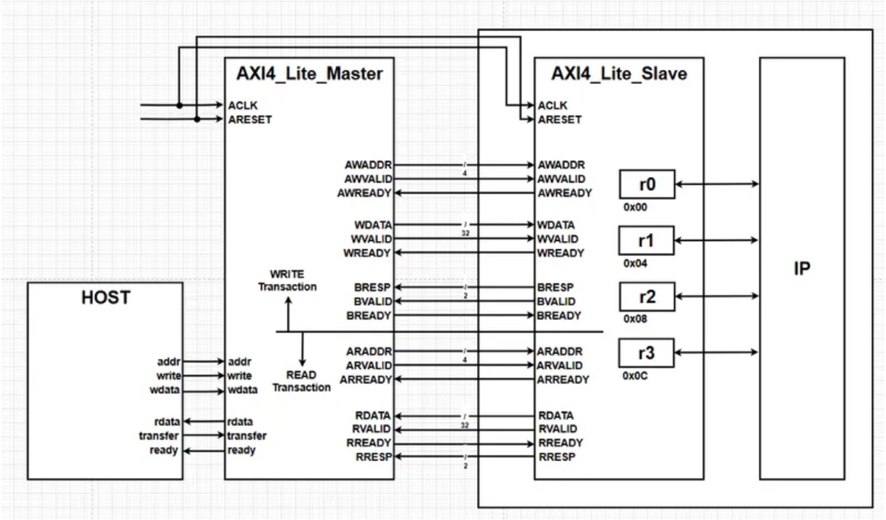
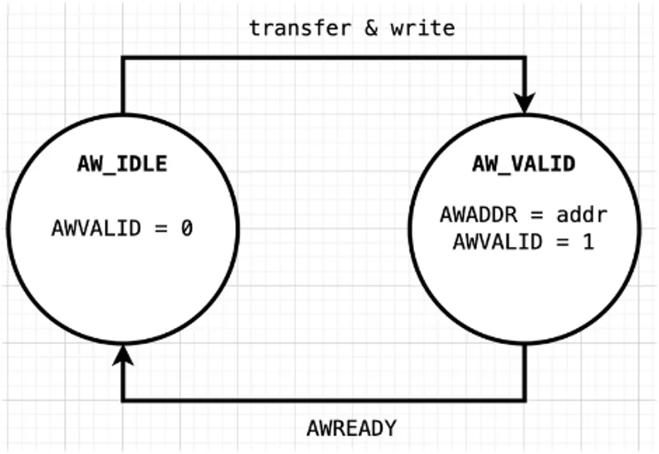
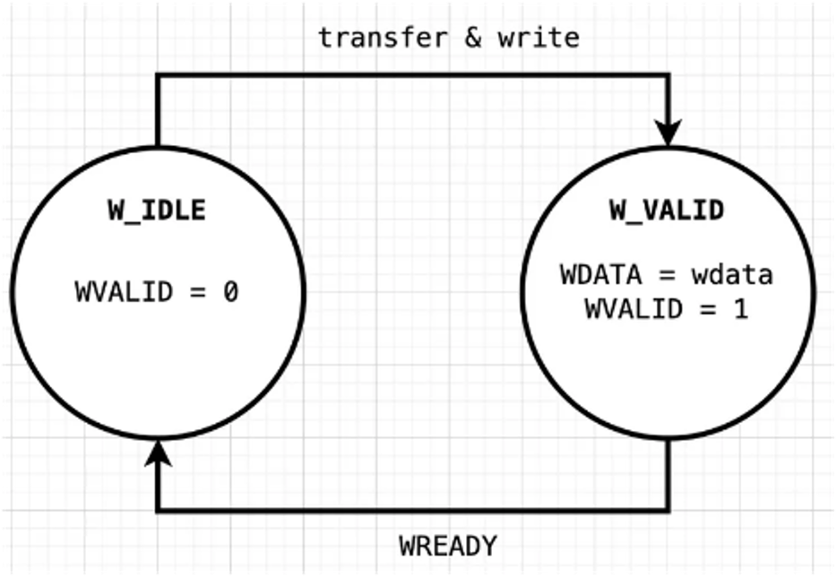
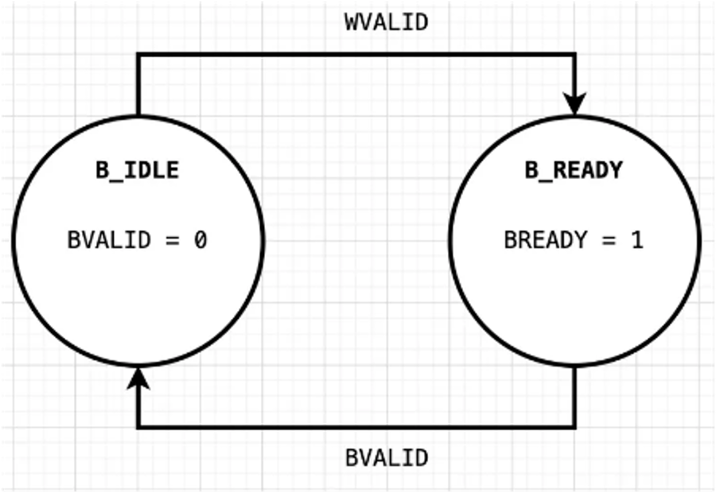
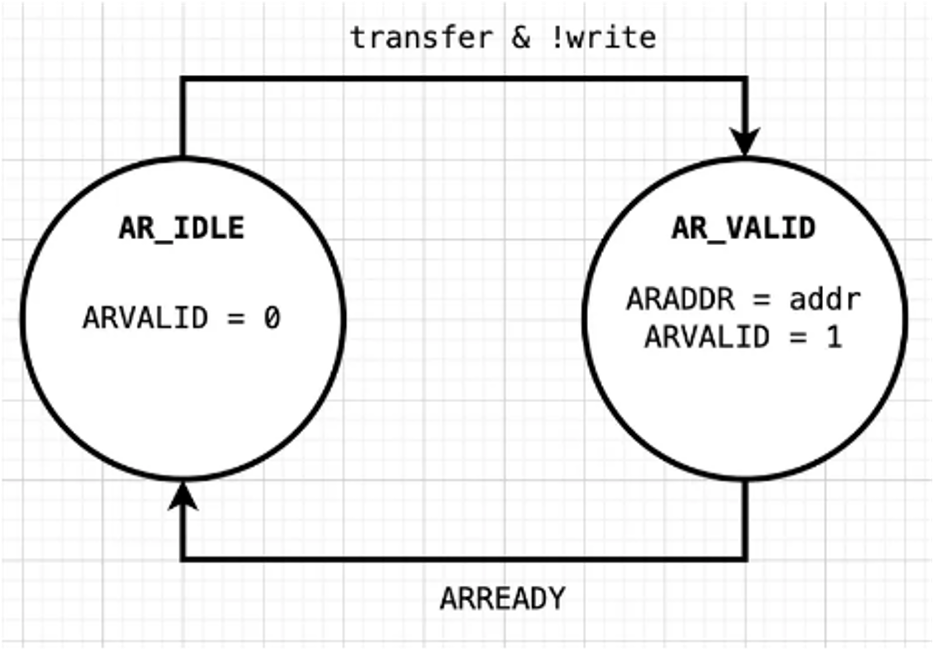
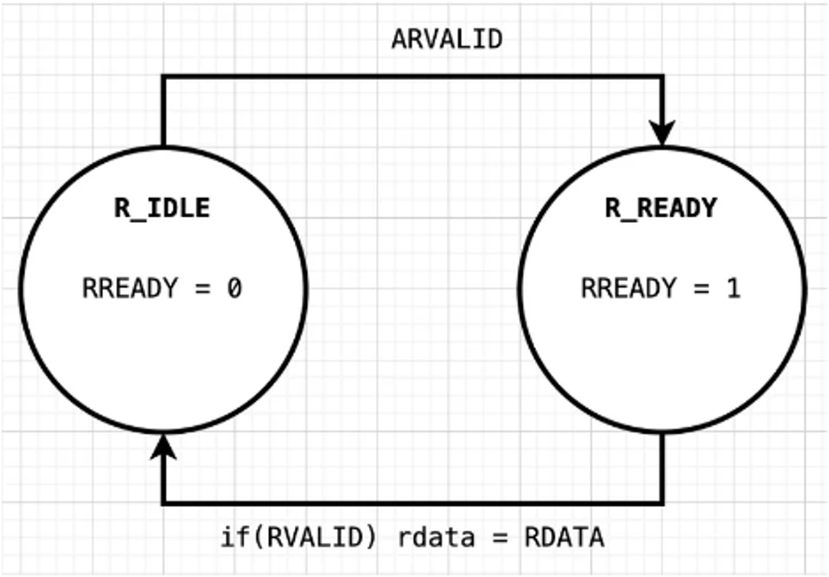

# MicroBlaze 기반 AXI4_Lite_Protocol

## 프로젝트 개요

## 개발 일정

## 개발 환경

|       | **TOOL** |
| :-----: | :-----: |
| **IDE**   |  |
| **Language** |   |
| **EDA**   |   |

## AXI4_Lite_Protocol

> ARM사의 AXI4-Lite 데이터시트를 기반으로, 주소 단계(Address Phase), 데이터 단계(Data Phase), 응답 단계(Response Phase)를 포함한 전송 타이밍을 분석하고 구현하였습니다.

#### 📝 [AXI4_Lite_Protocol Spec](./docs/AMBA_AXI.pdf)

| **AW** | **W** | **B** |
| :---: | :---: | :---: |
|  |  |  |

| **AR** | **R** |
| :---: | :---: |
|  |  |

## Memory Map

## Peripheral Block Diagram

## SystemVerilog Verification

## 📽️ 동작영상

