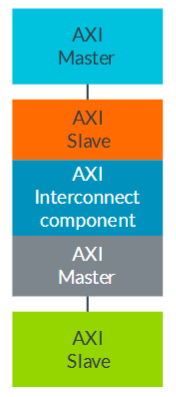

# Day 1

AXI4-Lite


AXI Interconnect component - IP 사용


### AXI_Protocol
📝 AXI 프로토콜은 **버스(bus)가 아니라 점대점(point-to-point)** 따라서 인터페이스 간의 신호와 타이밍만을 기술.

모든 연결은 master와 slave 사이의 신호와 타이밍을 통해 1:1로 연결

### AXI_Channel


AXI Interface는 5개의 메인 채널의 인터페이스로 구성되어있다.

Write 동작 방식
master는 slave에 AW(Write Address), W(Write Data)를 보낸다.
slave에서 master에 대한 응답이 끝나면 master에 B(Write Response)를 보낸다.

Read 동작 방식
master는 slave에 Read Address를 보낸다.
slave는 요청받은 주소의 데이터 R(Read Data)를 master로 보낸다. 

READ 동작에서 Response가 없는 이유
Write의 경우 데이터를 잘 썼는 지 확인해야하지만 Read의 경우는 주소를 받고 데이터를 찾아 보내주기 때문에 데이터와 Response를 한 채널에서 함께 보내는 구조이다.
```
AW for signals on the Write Address channel
AR for signals on the Read Address channel
W for signals on the Write Data channel
R for signals on the Read Data channel
B for signals on the Write Response channel
```

별도의 주소 및 데이터 채널을 사용하고 읽기 및 쓰기 채널 그룹 간에 타이밍 관계가 없으므로 인터페이스의 대역폭을 극대화할 수 있다. 이는 읽기 시퀀스가 쓰기 시퀀스와 동시에 일어날 수 있음을 의미

CPU, DMA 가 각각 읽기, 쓰기를 시도하는 경우에는 동시에 발생 가능

### AXI_HandShake


모든 채널은 같은 handshake 매커니즘(valid, ready)signal을 공유한다.
valid signal은 source에서 destination
ready signal은 destination에서 source로 이동

| channel | Master | Slave |
| :---: | :---: | :---: |
| AW | Source | Destination |
| W | Source | Destination |
| B | Destination | Source |
| AR | Source | Destination |
| R | Destination | Source |

### Difference between transfer and transaction

transfer는 한 채널에서 VALID, READY신호의 단일 교환 
transaction은 전체 채널에서 VALID, READY신호 교환
