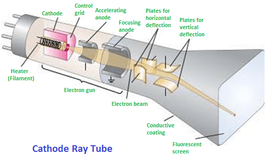
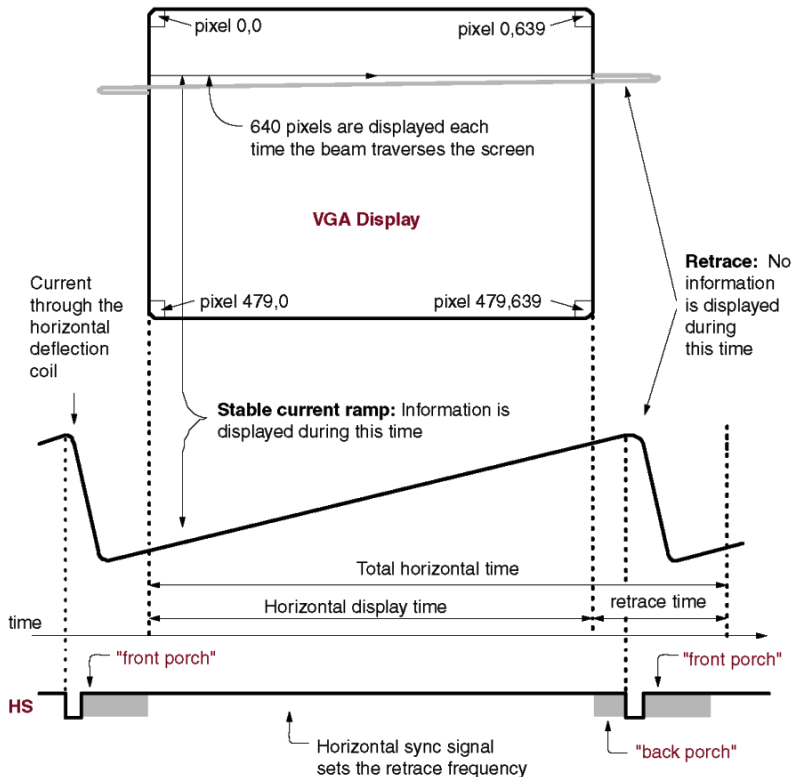

# Day 3

## Cathod Ray Tube





> porch : 

```sh
## Basys3 Board 는 RGB 444 규격을 가지고 있다.
##VGA Connector
#set_property -dict { PACKAGE_PIN G19   IOSTANDARD LVCMOS33 } [get_ports {vgaRed[0]}]
#set_property -dict { PACKAGE_PIN H19   IOSTANDARD LVCMOS33 } [get_ports {vgaRed[1]}]
#set_property -dict { PACKAGE_PIN J19   IOSTANDARD LVCMOS33 } [get_ports {vgaRed[2]}]
#set_property -dict { PACKAGE_PIN N19   IOSTANDARD LVCMOS33 } [get_ports {vgaRed[3]}]
#set_property -dict { PACKAGE_PIN N18   IOSTANDARD LVCMOS33 } [get_ports {vgaBlue[0]}]
#set_property -dict { PACKAGE_PIN L18   IOSTANDARD LVCMOS33 } [get_ports {vgaBlue[1]}]
#set_property -dict { PACKAGE_PIN K18   IOSTANDARD LVCMOS33 } [get_ports {vgaBlue[2]}]
#set_property -dict { PACKAGE_PIN J18   IOSTANDARD LVCMOS33 } [get_ports {vgaBlue[3]}]
#set_property -dict { PACKAGE_PIN J17   IOSTANDARD LVCMOS33 } [get_ports {vgaGreen[0]}]
#set_property -dict { PACKAGE_PIN H17   IOSTANDARD LVCMOS33 } [get_ports {vgaGreen[1]}]
#set_property -dict { PACKAGE_PIN G17   IOSTANDARD LVCMOS33 } [get_ports {vgaGreen[2]}]
#set_property -dict { PACKAGE_PIN D17   IOSTANDARD LVCMOS33 } [get_ports {vgaGreen[3]}]
#set_property -dict { PACKAGE_PIN P19   IOSTANDARD LVCMOS33 } [get_ports Hsync]
#set_property -dict { PACKAGE_PIN R19   IOSTANDARD LVCMOS33 } [get_ports Vsync]
```

R, G, B (Red, Green, Blue) 아날로그 신호: 각 픽셀의 색상 정보를 전달. 이 세 가지 색상의 밝기를 조합하여 다양한 색을 만들어 낼 수 있다. 전압 레벨이 높을수록 해당 색이 밝게 표시된다.

HS (Horizontal Sync) 수평 동기 신호: 한 줄의 픽셀 데이터 전송이 끝났음을 모니터에 알려 다음 줄로 이동하게 하는 신호.

VS (Vertical Sync) 수직 동기 신호: 한 화면(프레임)의 모든 픽셀 데이터 전송이 끝났음을 알려 모니터가 화면의 맨 위, 첫 번째 줄부터 다시 그리도록 하는 신호.